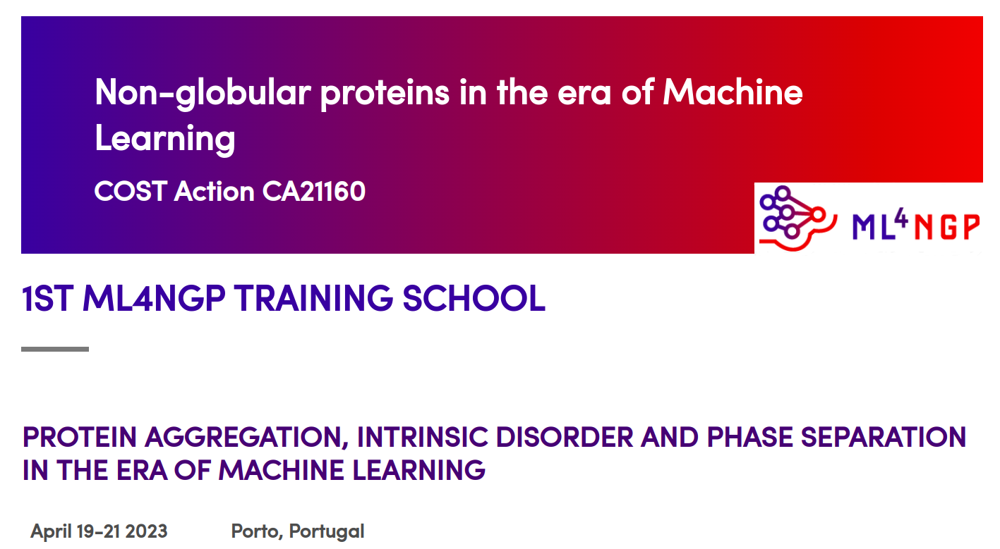

# ML4NGP Training School - Materials for Practical Session

  

# Instructions for participants

All of the materials for the Practical Session are in this GitHub repository.

<ins>1.step</ins> 
Open <b>Google Colab</b> - a Google product designed for writing and executing
arbitrary Python code through the browser 
Link: https://colab.research.google.com/

<ins>2.step</ins> 
Choose the <b>GitHub</b> option. In case of any pop up windows related to Colaboratory Authorization, choose 'Cancel'.

<ins>3.step</ins> 
Enter the following link to the materials template: 
https://github.com/nevenaciric/ML4NGP-practical/blob/main/Disorder-order%20classification%20of%20protein%20regions%20-%20Template.ipynb 
This link is obtained by clicking on the corresponding Jupyter Notebook inside this GitHub repository and copying its URL.

<ins>4.step</ins> 
Click the <b>Loop</b> (search) button

<ins>5.step</ins> 
Dowload dataset from <code>/data/DisProt_PDB_dataset.csv</code>

<u>6.step</u> 
In Google Colab click on the <b>Files</b> icon in the Toolbar on left side of the window

<ins>7.step</ins> 
Click on the <b>Upload to session storage</b> icon inside the Files Toolbar

<ins>8.step</ins> 
Navigate to the location of dowloaded dataset file <code>DisProt_PDB_dataset.csv</code>
